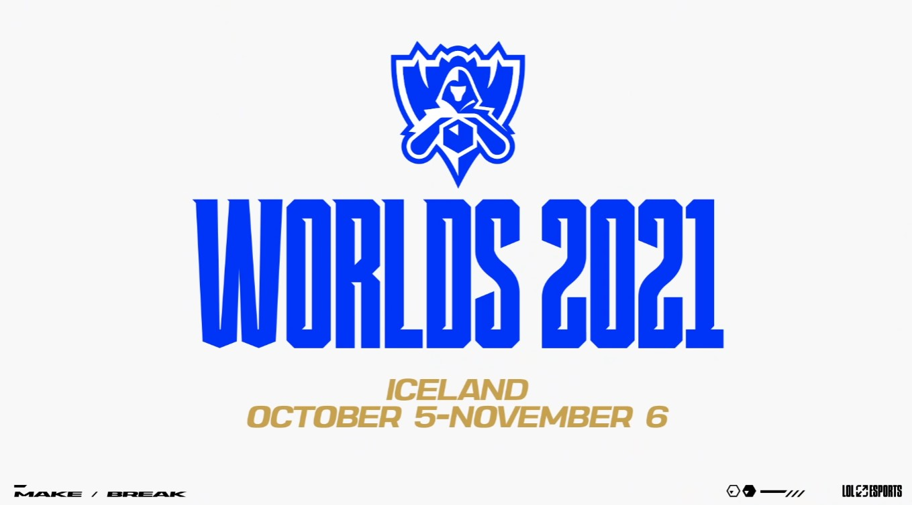
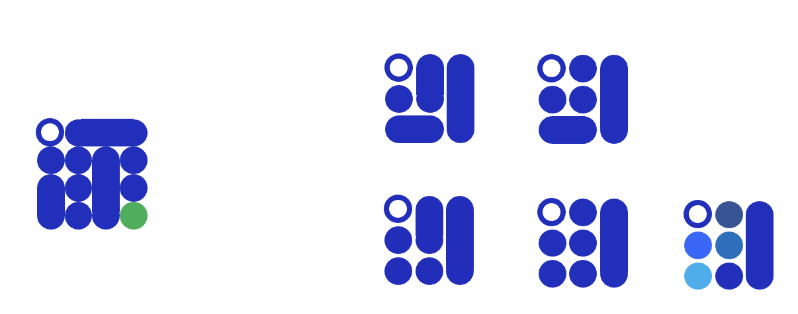

# Portfolio
> 포트폴리오 만들기! 문서와 웹 두가지 모두

### Prev Portfolio

-  [대전_3반_박종준_포트폴리오.pdf](File\대전_3반_박종준_포트폴리오.pdf) 

### 2022 Portfolio

- [2022포트폴리오_완성.pdf](File\2022포트폴리오_완성.pdf) 

### 컨셉

> 주제 : 점, 선, 면

- 점이 모여서 선이 되고, 선이 모여서 면이 된다.
  **기초적(점)** 인 것들이 쌓여서 하나의 **표헌(선)** 이 되고, 표현들이 모여서 하나의 **공간(면)** 이 된다. 
- 현재는 표현을 통해 공간을 하나씩 만들어 나가고 있다고 생각한다. 앞으로는 이러한 공간을 좀 더 구축하고 확장하여 공간들을 모아 하나의 **자아(입체)** 를 만들고자 한다.

1. 점

   - 점은 본질적이다. 부딪힘을 통해 하나의 점이 발생
   
     \> SW에 대한 도전, 그리고 교육과정을 통해 하나의 점을 완성.
     
     \> 여러가지 색의 점을 점차 늘려가야 함

2. 선

   - 선은 다양하다. 선은 자유롭게 그어나갈 수 있고 무한하게 이어갈 수 있다. 필자는 이를 표현이라고 정리 함

     \> 프로젝트들을 통해 여러가지 선을 그어봤고 현재도 다양한 선을 구축해 나가고 있는 단계.

3. 면

   - 면은 종합적이고 조화롭다. 구축해나간 선을 통해 여러 공간을 구축할 수 있고 무한히 다양한 선이 조화롭게 어울려져야 좋은 공간을 만들 수 있다.

     \> 선이 곧 면의 모양을 정하기 때문에 여러가지 선을 만들 수 있어야 한다.

     \> 현재는 계속해서 다양한 선을 통해 멋진 공간을 만들려고 노력 중

     \> 다양한 형태의 프로덕트를 만들어 나가고 있고 계속해서 선들을 추가하고 수정하면서 최적화 및 다양한 시도를 하고자 함

### 색상

- 개인적으로 선호하는 조합인 흰 + 파로 구성하고자 함

- 여름이기 때문에 푸른 계통으로 시원한 느낌과 쿨한 인상을 주고자 함도 있음
- 2021 롤드컵에서 인상깊게 봤던 파란색을 사용하려고 함
- 2021 롤드컵 색조합

- 파란색 : #0136f7

### 로고

- 로고는 나중에 필요시 첨부하는걸로..

- 로고는 역시 어렵다...
- 점 + 선 + 면으로 표현되는 로고를 만들고자 함
- 면 내부를 격자로 두고 점과 선으로 구분해서 면을 구성하는 점과 선들을 나타내고자 함
